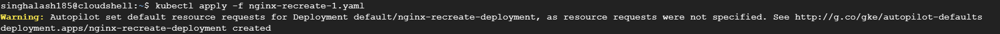
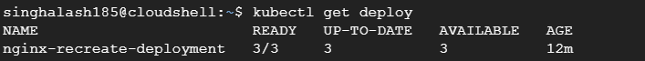
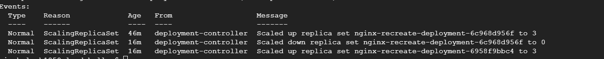
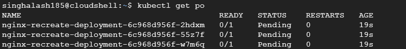

## Deploying ReplicaSets
It is written in spiral notebook.
By default it is using rolling update strategy.


## Creating ReplicaSets using deployments
```
kubectl apply -f nginx-recreate-1.yaml
```


## Get the deployment status
```
kubectl get deploy
```


## Get the more info via 
```
kubectl describe deploy
```
(Review this in markdown file with Preview)

Now in Message column, you can see, 
- Ist row indicates: when we created the first replica set i.e nginx-recreate-deployment,
After that when an Image with version has to updated, to Update the new image, 
nginx-recreate-2.yaml is deployed.
- 2nd row indicates:  it's a recreate strategy and initial to replica set scaled to zero.
- 3rd row indicates:  The replica set is scaled up to 3
****


## Get the pods status
```
kubectl get pods
```


